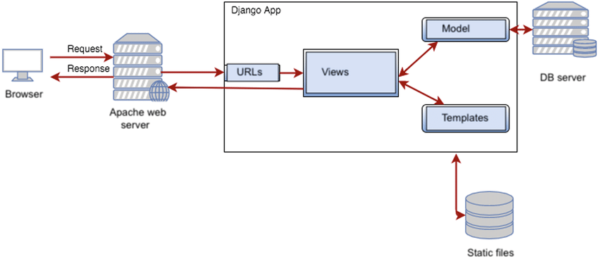

Deployed URL: http://tara-nirmala-footballshop.pbp.cs.ui.ac.id

ASSIGNMENT 3
A. Why do we need data delivery in implementing a platform?

So data from backend can be sent to other parts of the system and apps

B. In your opinion, which is better, XML or JSON? Why is JSON more popular than XML?

In my opinion, XML is harder to read and JSON is more simple and fits with JavaScript, so I personally likes JSON more. 

I think JSON is more popular because it is easier, more convinient, and more common.

C. What is the purpose of the is_valid() method in Django forms, and why do we need it?

It checks whether the data that user entered into the form is valid so that we can save it to the databse. If not valid then it will show errors.

It is important so that the datas that are collected are valid, correct, and complete

D. Why do we need a csrf_token when making forms in Django? What can happen if we don't include a csrf_token in a Django form? How can this be exploited by an attacker?

csrf_token is to prevent CSRF attacks. The token is used to make sure that the request (like adding product) comes from our form not attacker's.

E. Explain how you implemented the checklist above step-by-step (not just following the tutorial).

1. Add 4 news function
I create a new HTML file (base.html) that act as a base, update the settings.py to recognize base.html, create a productform in forms.py.

then lastly update the views.py to show_main to display all products, create_product to add products, show_product to show product detail, then the 4 new functions show_xml,show_json, show_xml_by_id, and show_json_by_id

2. Create URL routings
Just add the urlpatterns to 
urlpatterns = [
    path('', show_main, name='show_main'),
    path('create-product/', create_product, name='create_product'),
    path('product/<str:id>/', show_product, name='show_product'),
    path('xml/', show_xml, name='show_xml'),
    path('json/', show_json, name='show_json'),
    path('xml/<str:id>/', show_xml_by_id, name='show_xml_by_id'),
    path('json/<str:id>/', show_json_by_id, name='show_json_by_id'),
]

3. Add button and detail button
in main.html I added add product buttons to connect form project to create_project and detail button that connect detail page and product

4. create form page to add products
make a new html called create_product.html and use csrf_token for security

5. create a webpage to display details
make a new html called product_detail.html to show full info about the product. I also added a button to go back to products. 

6. use postman to test all the URLs

F. Do you have any feedback for the teaching assistants for Tutorial 2?
No, everything was great and the TAs are very helpful

G. Postman

ASSIGNMENT 2
A. How I implemented the checklist:

1. Create a new Django project
    so first i create the folder football-shop through file explorer, then i opened the file in VS code. 
    
    Then I create and activate the environment (python -m venv env, env\Scripts\activate)
    
    Then I install the dependencies by adding 
        django
        gunicorn
        whitenoise
        psycopg2-binary
        requests
        urllib3
        python-dotenv
    to requirements.txt and pip install -r requirements.txt

    Then I create the django project: django-admin startproject football_shop .

    After that I set the production = False in .env and set my DB name, host, port, use, password, schema = tugas_individu and production = True in .env.prod for future push to the PWS. 

    And then I change the setting.py with adding 
    import os 
    from dotenv import load_dotenv()
    ALLOWED_HOSTS = ["localhost", "127.0.0.1"]
    PRODUCTION = os.getenv('PRODUCTION', 'False').lower() == 'true', and # 
    
    and Database configuration
        if PRODUCTION:
            # Production: use PostgreSQL with credentials from environment variables
            DATABASES = {
                'default': {
                    'ENGINE': 'django.db.backends.postgresql',
                    'NAME': os.getenv('DB_NAME'),
                    'USER': os.getenv('DB_USER'),
                    'PASSWORD': os.getenv('DB_PASSWORD'),
                    'HOST': os.getenv('DB_HOST'),
                    'PORT': os.getenv('DB_PORT'),
                    'OPTIONS': {
                        'options': f"-c search_path={os.getenv('SCHEMA', 'public')}"
                    }
                }
            }
        else:
            # Development: use SQLite
            DATABASES = {
                'default': {
                    'ENGINE': 'django.db.backends.sqlite3',
                    'NAME': BASE_DIR / 'db.sqlite3',
                }
            }

    Lastly, I run migration & Local Server (python manage.py migrate, python manage.py runserver)

2. Create an application named main
    Create main app: python manage.py startapp main

3. Congigure routing in the project to run in the main
application
    Add 'main' to INSTALLED_APPS

4. Create a model in the main application named product
        import uuid
        from django.db import models

        class Product(models.Model):
            id = models.UUIDField(primary_key=True, default=uuid.uuid4, editable=False)

            name = models.CharField(max_length=100)
            price = models.IntegerField()
            description = models.TextField()
            thumbnail = models.URLField()
            category = models.CharField(max_length=100)
            is_featured = models.BooleanField(default=False)

            def __str__(self):
                return self.name 

    Then I run it (python manage.py makemigrations, 
        python manage.py migrate)

5. Create a function in views.py for app name, my name, and my class.
    from django.shortcuts import render
    def show_main(request):
        context = {
            'app_name' : 'Football Shop', 
            'name': 'Tara Nirmala Anwar',
            'class': 'KKI'
        }
        return render(request, "main.html", context)

    then i also add the templates folder + i made main.html inside of it. = 
    
{{ name }}

    <h4>Class:</h4>
    
{{ class }}

    
Welcome to the Football Shop assignment 2!

6. routing in urls.py of the main app to map views.py
    in main urls.py =
    from django.urls import path
    from main.views import show_main
    app_name = 'main'
    urlpatterns = [
        path('', show_main, name='show_main'),
    ]

    in football_shop urls.py =
    add include = from django.urls import path, include
    add path('', include('main.urls')), in urlpatterns
    add addition for ALLOWED_HOSTS = ["localhost", "127.0.0.1", "tara_nirmala-footballshop.pbp.cs.ui.ac.id"] 

7. Deployment of urls.py
    Since we have added my PWS data to .env.prod as well as adding my URL tp ALLOWED_HOSTS, now we push it to github by git add., git commit -m, git push origin master

    then lastly we push it to PWS with git push pws master

8. And now I am making the README.md by answering the questions + adding URL

9. addition that i did = changed debug to False also I used "_" instead of "-" for my URL so i had to change it because of an error in the ALLOWED_Hosts

B. Diagram

Source = https://www.researchgate.net/figure/Specific-Django-architecture_fig1_332023947

Explanation = the daigram shows request -> DJango -> Response
1. Browser (client): the user visits my site (https://tara-nirmala-footballshop.pbp.cs.ui.ac.id/) and the browser sends an HTTP requests
2. Web server : The request reaches the server and is forwarded to my Django APP
3. urls.py: Django's URL resolver matches the request path to a route. if no pattern, returns 404 Not Found
4. views.py: optional validation, cookies, fetch n update data, prepare context for the template
5. models.py: data scheme and business rule and talk to the DB server
6. templates: to see HTML page (what users see), in my case: main.html
7. HTTP response back to browser: Django returns the rendered HTML to the server (returns it to the browser) then the browser display the image
8. statics files are requested separately

so its browser, server, urls.py, views.py, templates and model, response, browser

Relationship of urls.py, views.py, models.py, and HTML = 
urls.py = the router that matches the URL to the correct view
views.py = logic for processiong requests
models.py = the data structure and also to update the database
HTML = define what the users see

C. role of settings.py in a Django project
it defines all the important settings your application needs to run (blueprint environment) such as database configuration, installed apps, security settings, and so much more. 

D. How database migration work
1. Define the models in models.py
2. Run python manage.py makemigrations to create a migration file that record changes
3. run pyhton manage.py migrate to apllies those changes to the actual database

E. Why Django framework for starting point?
This is my first time learning software development so I still don't know much about it. But from my experience Django provides many feature already so we can focus on understanding the concepts instead of building everything from scratch which can overwhelmed a lot of people. Django also already has a lot of users, tutorials online, strong documentation, which helps beginner learn and dive into software development. 

F. feedback 
The teaching assitant explained everything clearly and was super helpful throughout the tutorials. I have no complaints and I appreciate the patience and clarity. Thank you kakak kakak!

